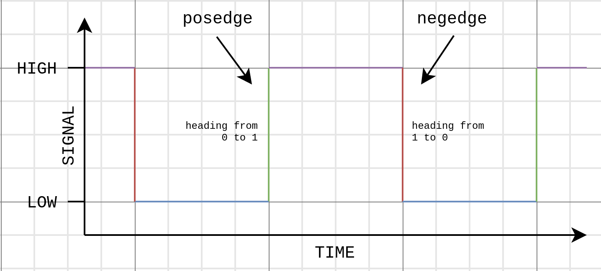

# Signals
### Digital Signals
Digital Signals are a representation of set discrete values, a signal can only represent a single value at a time. The most common kind is binary representing only two discrete values -- 0 and 1.
### Analogue Signals
Analogue Signals vary as they can represent a continuous range of values, often represented by a voltage.
## Binary Signal
A binary signal is a signal that is used to represent two values, either 0 or 1, it can only be one of these at any time. Low and High are used in place of 0 and 1. The transition from Low to High is called the rising edge or positive edge, whereas the transition from High to Low is called the falling edge or negative edge. In terms of Verilog keywords these are referred to as `posedge` and `negedge`.

