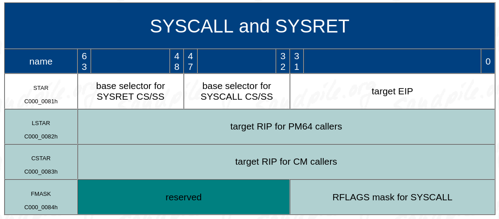

# System Calls on x86_64
The purpose of system call is to switch from user space to kernel space, this is done to access I/O of perform privileged actions. There are three ways which system calls can be performed on x86_64: a trap, a software interrupt, or with syscall/sysexit. These are ordered in terms of how fast they are.

## Parameter passing
Parameter passing is done through the registers most often, this is very fast but it can't store a large amount of data. Often a pointer will be passed through registers from user space, The kernel should thoroughly check that the pointer is valid and safe to dereference before doing so. System calls may also use pre-allocated chunks of memory to send to data to other process or the kernel. In terms of IPC Minix does something like this with [memory grants](https://wiki.minix3.org/doku.php?id=developersguide:memorygrants) allowing two processes to share large amount of data (>64-bytes) much more efficiently.

## Trap
This is the slowest and clunkiest method to perform a system call, however it has the advantage that it can only take a single byte (1-byte) to trigger, with something like `int3` or `ud2` -- L4 uses `lock nop` which is illegal however no ideal because it may change at anytime unlike `ud2`. This than triggers a trap gate in the IDT which will check to make sure that the program has actually asked for a syscall and not fucked up.

## Software Interrupt
This is a simple method to setup as an interrupt are probably already setup, how it can be quite slow because it does a bunch of extra stack manipulation along with touching both the GDT/IDT (structure in memory) and performing a bunch of checks to make sure shit is sure. Many software interrupts gates can be set up, however often only 1 is setup -- 0x80 (127) and then `rax` is used to determine the method of the syscall. This is the same as how DOS and BIOS functions work.

## syscall/sysexit
These are two pairs on instructions, they are both 2 bytes each, they work by loading special values into MSR (model specific registers), than calling `syscall` from user space to get to kernel space, and `sysexit` to return back to userspace. Look to section 5.8.8 of Intel Manual Vol. 3A

